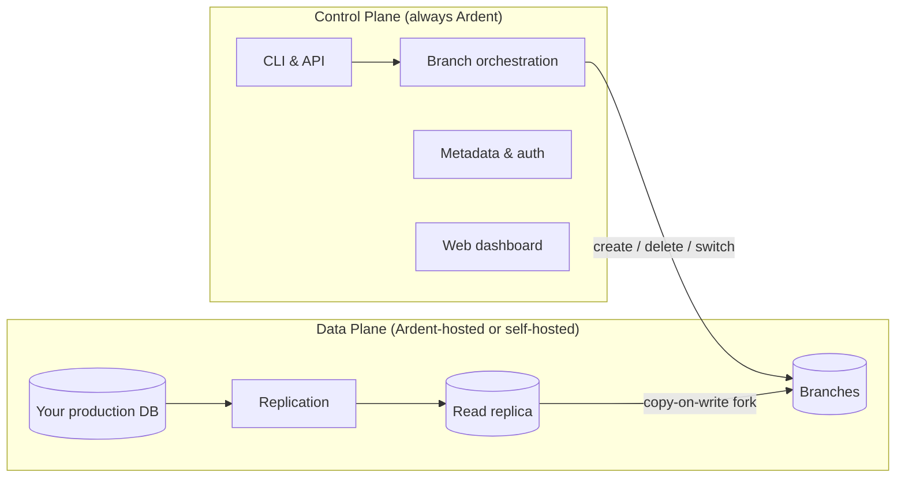

Ardent is built around two planes: a **control plane** that Ardent always manages, and a **data plane** where your data and compute live. The data plane can be hosted by Ardent or by you.

## The two planes

### Control plane

The control plane is always operated by Ardent. It handles:

- The CLI and REST API
- Branch lifecycle management — create, switch, delete
- Authentication and access control
- Your web dashboard and billing

You never run this yourself. It's the SaaS layer that makes everything work.

### Data plane

The data plane is where your data actually lives and where branches are computed. It contains:

- The replication layer that syncs from your production database
- The read replica that branches fork from
- The branch compute — each branch is a lightweight copy-on-write fork of the replica

**This is the layer you can choose to host yourself.**

---

## Deployment options

| | **Ardent Cloud** | **Self-hosted** | **Enterprise** |
|---|---|---|---|
| **Control plane** | Ardent | Ardent | Ardent |
| **Data plane** | Ardent | You | Custom |
| **Plan** | Free / Growth | Scale ($250/mo) | Enterprise |
| **Data leaves your infra** | Yes | No | No |
| **Custom networking** | — | Yes | Yes |
| **On-prem / data residency** | — | — | Yes |

### Ardent Cloud (default)

Ardent hosts everything. You connect your database, we handle replication, storage, and branch compute in our infrastructure. Fastest way to get started — works on the free tier and Growth plan.

### Self-hosted data plane (Scale)

On the Scale plan, you deploy the Ardent data plane into your own cloud account. Your data never leaves your infrastructure. Ardent's control plane still orchestrates branches via API, but all compute and storage runs in your VPC.

Good for teams with data residency requirements or who need branches to run inside their own network.

### Enterprise

Custom data plane deployment — on-prem, custom regions, dedicated infrastructure, custom networking. [Talk to us.](mailto:vikram@tryardent.com)

---

## How branching works

Regardless of where the data plane runs, the branching mechanism is the same:

1. **Replication** — Ardent connects to your production database via logical replication and keeps a read replica in sync
2. **Fork** — when you run `ardent branch create`, we take a copy-on-write snapshot of the replica. No data is duplicated — only changes you make on the branch consume additional storage
3. **Isolation** — each branch is a fully independent Postgres database. Write to it, break it, delete it — your production database is never touched
4. **Cleanup** — delete the branch and the storage is reclaimed instantly
