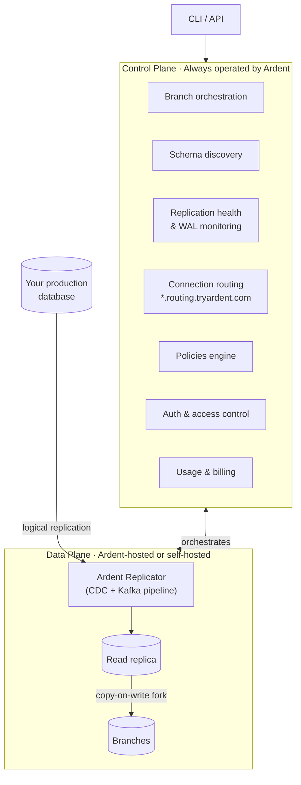

Ardent is built around two planes: a **control plane** that Ardent always operates, and a **data plane** where your data lives and branches are computed. The data plane can be hosted by Ardent or deployed into your own infrastructure.

## The two planes

---

## Control plane

The control plane is always operated by Ardent. It's the brain of the platform — every CLI command, every branch operation, every health check flows through it.

**What it manages:**

- **Branch orchestration** — create, suspend, delete, and switch branches on demand; enforces branch lifecycle and auto-suspend after inactivity
- **Schema discovery** — when you connect a database, the control plane inspects your schema, validates replication prerequisites, and configures the replication pipeline
- **Replication health & WAL monitoring** — continuously monitors replication lag, WAL slot health, and CDC pipeline status; automatically quarantines and recovers from failures
- **Connection routing** — every branch URL (`*.routing.tryardent.com`) is resolved in real time by the routing proxy, which looks up the live branch endpoint and pipes your connection through
- **Policies engine** — connector-scoped policies like `default_db` and `branch_sql` hooks that apply automatically to every branch on a connector
- **Auth & access control** — JWT, API keys, org-level RBAC, invites, and role management
- **Usage & billing** — tracks branch hours and storage, Stripe-integrated

---

## Data plane

The data plane is where your data actually lives and where branches are computed. It has three components:

**Ardent Replicator** — the replication engine that runs as a managed service inside the data plane. It connects to your production database via logical replication, processes the change stream through a Kafka pipeline, and keeps the read replica continuously in sync. This is the component you deploy into your own infrastructure on the Scale plan.

**Read replica** — a continuously updated copy of your production database. Branches are forked from here, not from production directly — so your production database is never under branch load.

**Branches** — lightweight copy-on-write forks of the read replica. Only the changes you make on a branch consume additional storage. Creating a branch takes under 6 seconds regardless of database size.

---

## Deployment options

| | **Ardent Cloud** | **Self-hosted** | **Enterprise** |
|---|---|---|---|
| **Control plane** | Ardent | Ardent | Ardent |
| **Ardent Replicator** | Ardent's infrastructure | Your infrastructure | Your infrastructure |
| **Data leaves your network** | Yes | No | No |
| **Plan** | Free / Growth | Scale ($250/mo) | Enterprise |
| **Data residency** | — | Yes | Yes |
| **Custom networking / on-prem** | — | — | Yes |

### Ardent Cloud

Ardent hosts the entire data plane. You connect your database and we handle the Ardent Replicator, the read replica, and branch compute in our infrastructure. Works on the free tier and Growth plan — fastest way to get started.

### Self-hosted data plane (Scale)

On the Scale plan, the Ardent Replicator deploys into your own cloud account. Your data never leaves your infrastructure. The control plane still orchestrates everything via API — branch creates, health monitoring, routing — but all replication and branch compute runs inside your network.

Good for teams with data residency requirements, compliance constraints, or who need branches to run inside their own VPC.

### Enterprise

Custom deployment — on-prem, custom regions, dedicated infrastructure, bespoke networking. [Talk to us.](mailto:vikram@tryardent.com)
