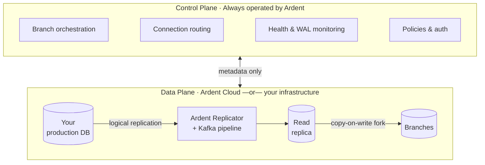

Ardent follows a split-plane architecture where the **control plane** and **data plane** are separated:

- **Control plane** — Operated by Ardent. Handles branch orchestration, replication health monitoring, connection routing, auto-scaling, and policy enforcement. Spans across all deployments.
- **Data plane** — Where your data lives. The Ardent Replicator syncs from your production database via a Kafka pipeline into a read replica. Branches are instant copy-on-write forks off that replica.

Only metadata (schema structure, replication status, branch state) flows from the data plane to the control plane. Your actual data never leaves the data plane.

## How it works

## What we manage for you

Replication and branching carry a lot of operational work. Ardent runs that layer end to end so your team is not building CDC infrastructure, babysitting slots, or writing recovery playbooks.

**WAL slot health** — Replication slots can lag and grow until they threaten your primary. We monitor slot health and WAL pressure, clean up safely after disconnects, and keep replication recoverable without you tuning Postgres internals.

**Schema changes in flight** — Production schema does not stand still. We keep the pipeline aligned as tables and columns change, so adds, drops, and type shifts do not leave you with a broken replica or a stalled stream.

**Durability across restarts and failures** — Retries, restarts, and network blips are where pipelines usually duplicate or drop rows. We preserve ordering and integrity across the pipeline so your replica stays trustworthy.

**Recovery when something goes wrong** — When CDC hiccups, the alternative is often a manual replay or a late-night incident. We detect failures, isolate bad streams when needed, and resume from the right point — without you maintaining custom tooling.

**Fast branches regardless of database size** — Branches fork off the read replica with copy-on-write semantics, so `ardent branch create` stays fast even when your production database is large — without full copies or long provisioning steps.

You connect your database and use branches. We operate what sits in between.

---

## Deployment options

The control plane is always Ardent's. The data plane can be ours or yours.

| | **Ardent Cloud** | **Self-hosted** | **Enterprise** |
|---|---|---|---|
| **Control plane** | Ardent | Ardent | Ardent |
| **Data plane** | Ardent's infrastructure | Your infrastructure | Your infrastructure |
| **Data leaves your network** | Yes | No | No |
| **Plan** | Free / Growth | Scale ($250/mo) | Enterprise |
| **Data residency / on-prem** | — | — | Yes |

**Ardent Cloud** — We host the entire data plane. Connect your database and we handle the Ardent Replicator, Kafka pipeline, read replica, and branch compute. Available on all plans.

**Self-hosted (Scale)** — The Ardent Replicator deploys into your own cloud account. Your data never leaves your infrastructure. The control plane still orchestrates everything via API, but all replication and branch compute runs inside your network.

**Enterprise** — Custom deployment, on-prem, dedicated infrastructure. [Talk to us.](mailto:vikram@tryardent.com)
