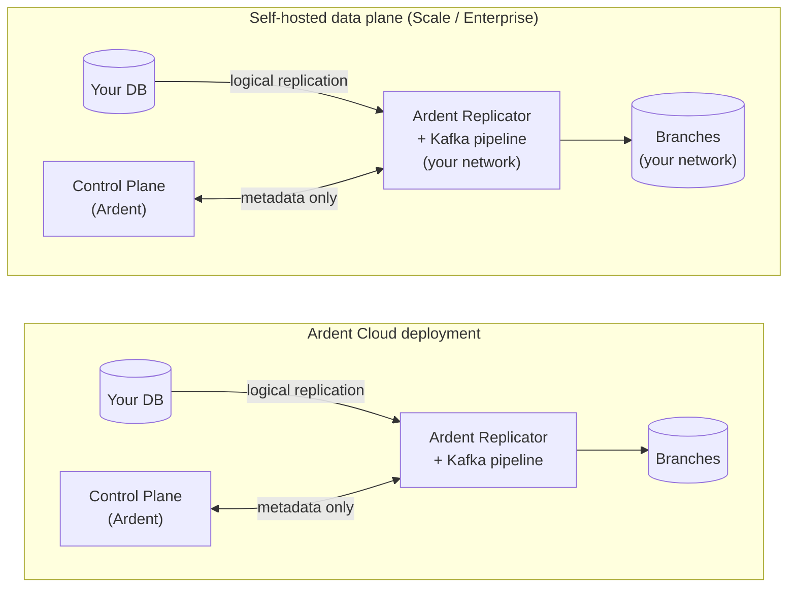

Ardent follows a split-plane architecture where the **control plane** and **data plane** are separated:

- **Control plane** — Operated by Ardent. Handles branch orchestration, replication health monitoring, connection routing, auto-scaling, and the Kafka pipeline that keeps your replica in sync.
- **Data plane** — Where your data lives. The Ardent Replicator continuously syncs from your production database and serves instant branch forks on demand.

Only metadata (schema structure, replication status, branch state) is sent from the data plane to the control plane. Your actual data never leaves the data plane.

## Deployment options

| | **Ardent Cloud** | **Self-hosted** | **Enterprise** |
|---|---|---|---|
| **Control plane** | Ardent | Ardent | Ardent |
| **Data plane** | Ardent's infrastructure | Your infrastructure | Your infrastructure |
| **Data leaves your network** | Yes | No | No |
| **Plan** | Free / Growth | Scale ($250/mo) | Enterprise |
| **Data residency / on-prem** | — | — | Yes |

### Ardent Cloud

Ardent hosts everything. Connect your database and we handle the rest — replication, Kafka, branch compute, auto-scaling. Fastest way to get started, available on all plans.

### Self-hosted (Scale)

The Ardent Replicator deploys into your own cloud account. Your data never leaves your infrastructure. The control plane orchestrates branches and manages replication health via API, but all data processing runs inside your network.

### Enterprise

Custom deployment, on-prem, dedicated infrastructure, custom networking. [Talk to us.](mailto:vikram@tryardent.com)
