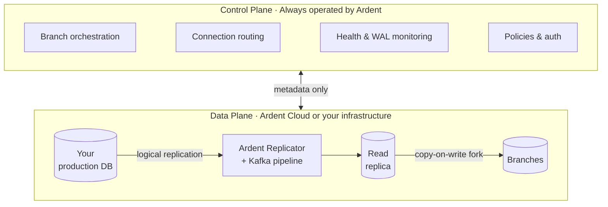

Ardent follows a split-plane architecture where the **control plane** and **data plane** are separated:

- **Control plane:** Operated by Ardent. Handles branch orchestration, replication health monitoring, connection routing, auto-scaling, and policy enforcement. Spans across all deployments.
- **Data plane:** Where your data lives. The Ardent Replicator syncs from your production database via a Kafka pipeline into a read replica. Branches are instant copy-on-write forks off that replica.

Only metadata (schema structure, replication status, branch state) flows from the data plane to the control plane. Your actual data never leaves the data plane.

## How it works

## What each layer does for you

The split is not only where code runs, but what each layer is responsible for. Together they are why you get branches without operating a replication platform yourself.

### Control plane

Always operated by Ardent. Orchestration, policies, routing, and visibility across every branch and connection.

- **Branch lifecycle:** Create, suspend, delete, and route traffic to the right branch. Connection URLs go through Ardent so every session is tied to an account and can enforce rules, hooks, and policies.
- **Replication coordination:** Monitors health, lag, and pipeline status from metadata; scales and manages the Kafka layer that backs replication so you are not sizing or operating brokers yourself.
- **Connector setup:** Discovery and validation when you connect a database, plus connector-scoped settings such as default database and branch SQL hooks.
- **Auth, usage, and billing:** Org access, API keys, and metering. Per-user and per-branch visibility Postgres does not give you out of the box.

### Data plane

Where your data physically lives and where branches are served from. Runs on Ardent Cloud or in your own account on Scale and Enterprise.

- **Ardent Replicator**
  - Takes logical replication from production through a Kafka-backed pipeline into the read replica.
  - Handles DDL in flight using **custom event triggers** that detect DDL on the primary and replay it **in order** on the replica, so schema changes keep streaming without stalls or silent drift.
  - Applies changes in order across failures so retries do not leave gaps or duplicates.
  - Manages WAL and slot pressure so replication does not destabilize the primary.
  - Quarantines, resumes, and recovers broken streams without manual replay scripts.
- **Read replica:** Stays in sync with production; branches are never forked straight off production, so branch load never hits your primary.
- **Branch storage:** Copy-on-write forks off the replica. Fast to create at any size, cheap to leave idle.
- **Isolation:** Your table data stays inside this boundary. Only metadata crosses to the control plane.

You connect your database and open branches. The control plane orchestrates; the data plane runs replication, the replica, and branches.

---

## Deployment options

The control plane is always Ardent's. The data plane can be ours or yours.

| | **Ardent Cloud** | **Self-hosted** | **Enterprise** |
|---|---|---|---|
| **Control plane** | Ardent | Ardent | Ardent |
| **Data plane** | Ardent's infrastructure | Your infrastructure | Your infrastructure |
| **Data leaves your network** | Yes | No | No |
| **Plan** | Free / Growth | Scale ($250/mo) | Enterprise |
| **Data residency / on-prem** | No | No | Yes |

**Ardent Cloud.** We host the entire data plane. Connect your database and we handle the Ardent Replicator, Kafka pipeline, read replica, and branch compute. Available on all plans.

**Self-hosted (Scale).** The Ardent Replicator deploys into your own cloud account. Your data never leaves your infrastructure. The control plane still orchestrates everything via API, but all replication and branch compute runs inside your network.

**Enterprise.** Custom deployment, on-prem, dedicated infrastructure. [Talk to us.](mailto:vikram@tryardent.com)
