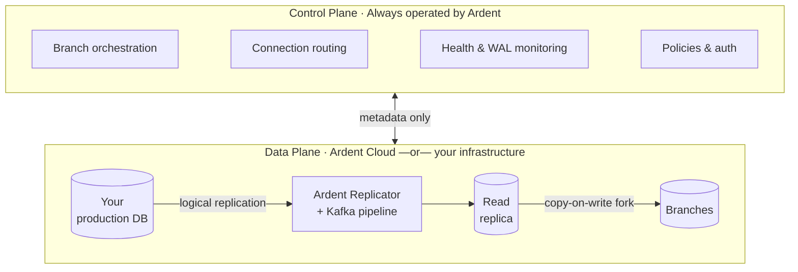

Ardent follows a split-plane architecture where the **control plane** and **data plane** are separated:

- **Control plane** — Operated by Ardent. Handles branch orchestration, replication health monitoring, connection routing, auto-scaling, and policy enforcement. Spans across all deployments.
- **Data plane** — Where your data lives. The Ardent Replicator syncs from your production database via a Kafka pipeline into a read replica. Branches are instant copy-on-write forks off that replica.

Only metadata (schema structure, replication status, branch state) flows from the data plane to the control plane. Your actual data never leaves the data plane.

## How it works

## Deployment options

The control plane is always Ardent's. The data plane can be ours or yours.

| | **Ardent Cloud** | **Self-hosted** | **Enterprise** |
|---|---|---|---|
| **Control plane** | Ardent | Ardent | Ardent |
| **Data plane** | Ardent's infrastructure | Your infrastructure | Your infrastructure |
| **Data leaves your network** | Yes | No | No |
| **Plan** | Free / Growth | Scale ($250/mo) | Enterprise |
| **Data residency / on-prem** | — | — | Yes |

**Ardent Cloud** — We host the entire data plane. Connect your database and we handle the Ardent Replicator, Kafka pipeline, read replica, and branch compute. Available on all plans.

**Self-hosted (Scale)** — The Ardent Replicator deploys into your own cloud account. Your data never leaves your infrastructure. The control plane still orchestrates everything via API, but all replication and branch compute runs inside your network.

**Enterprise** — Custom deployment, on-prem, dedicated infrastructure. [Talk to us.](mailto:vikram@tryardent.com)
