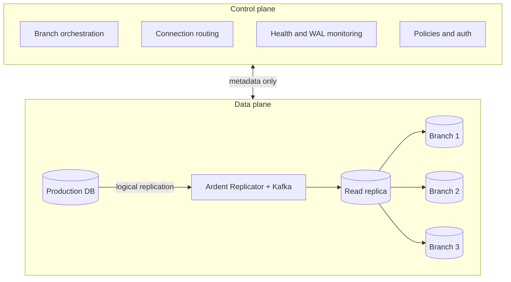

Ardent follows a split-plane architecture where the **control plane** and **data plane** are separated:

- **Control plane:** Operated by Ardent. Handles branch orchestration, replication health monitoring, connection routing, auto-scaling, and policy enforcement. Spans across all deployments.
- **Data plane:** Where your data lives. The Ardent Replicator syncs from your production database via a Kafka pipeline into a read replica. **Branches** are isolated Postgres databases created from that replica, each with **auto-scaling compute** and its own storage.

Only metadata (schema structure, replication status, branch state) flows from the data plane to the control plane. Your actual data never leaves the data plane.

## How it works

### Control plane

Always operated by Ardent. Orchestration, policies, routing, and visibility across every branch and connection.

- **Branch lifecycle:** Create, suspend, delete, and route traffic to the right branch. Connection URLs go through Ardent so every session is tied to an account and can enforce rules, hooks, and policies.
- **Replication coordination:** Monitors health, lag, and pipeline status from metadata; scales and manages the Kafka layer that backs replication so you are not sizing or operating brokers yourself.
- **Connector setup:** Discovery and validation when you connect a database, plus connector-scoped settings such as default database and branch SQL hooks.
- **Auth, usage, and billing:** Org access, API keys, and metering. Per-user and per-branch visibility Postgres does not give you out of the box.

### Data plane

Where your data physically lives and where branches are served from. Runs on Ardent's infrastructure (fully managed) or in your own cloud account (managed, your cloud).

- **Ardent Replicator**
  - Takes logical replication from production through a Kafka-backed pipeline into the read replica.
  - Handles DDL in flight using **custom event triggers** that detect DDL on the primary and replay it **in order** on the replica, so schema changes keep streaming without stalls or silent drift.
  - Applies changes in order across failures so retries do not leave gaps or duplicates.
  - Manages WAL and slot pressure so replication does not destabilize the primary.
  - Quarantines, resumes, and recovers broken streams without manual replay scripts.
- **Read replica:** Stays in sync with production; branches are always created from the replica, never from production directly, so branch load never hits your primary.
- **Branches (compute and storage):** Each branch is a full Postgres instance with **compute that auto-scales with load**. Storage is built on the same replica snapshot so new branches stay fast to create at any data size and stay inexpensive when idle, while queries and connections run on elastic branch compute.
- **Isolation:** Your table data stays inside this boundary. Only metadata crosses to the control plane.

You connect your database and open branches. The control plane orchestrates; the data plane runs replication, the replica, and branches.

---

## Deployment options

Ardent orchestrates everything from our control plane. The data plane is the only thing that moves.

| | **Fully managed** | **Managed, your cloud** |
|---|---|---|
| **Control plane** | Ardent infrastructure | Ardent infrastructure |
| **Data plane** | Ardent infrastructure | Your cloud account |
| **Data residency** | Ardent's cloud | Your cloud |

Both modes are fully managed by Ardent. The difference is where the data plane runs.

**Fully managed.** We host the entire data plane. Connect your database and we handle the Ardent Replicator, Kafka pipeline, read replica, and branch compute.

**Managed, your cloud.** Same managed experience, but the data plane deploys into your own cloud account. Your data never leaves your infrastructure. The control plane still orchestrates everything via API; all replication and branch compute runs inside your network.
