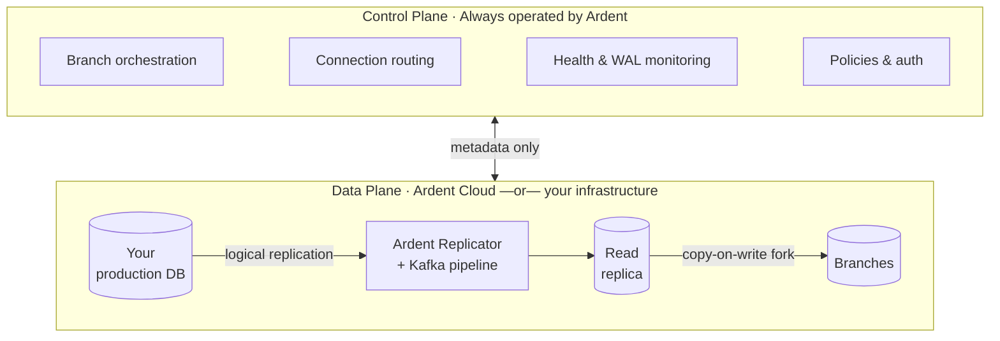

Ardent follows a split-plane architecture where the **control plane** and **data plane** are separated:

- **Control plane** — Operated by Ardent. Handles branch orchestration, replication health monitoring, connection routing, auto-scaling, and policy enforcement. Spans across all deployments.
- **Data plane** — Where your data lives. The Ardent Replicator syncs from your production database via a Kafka pipeline into a read replica. Branches are instant copy-on-write forks off that replica.

Only metadata (schema structure, replication status, branch state) flows from the data plane to the control plane. Your actual data never leaves the data plane.

## How it works

## What makes this hard to build

Database branching sounds simple. Replication plus snapshots. The reality is messier — and the failure modes are production-impacting.

**WAL slot management without killing your primary**
Postgres replication slots hold WAL data until the replica has consumed it. If replication falls behind, slots grow unbounded — filling disk and eventually crashing your primary. Managing slot lag, pruning safely, and recovering without data loss is a full-time problem.

**Schema changes mid-stream**
When someone runs `ALTER TABLE` on production, the replication pipeline has to handle it in real time — without corrupting the replica, dropping rows, or stalling the stream. Add columns, drop columns, change types: each has different failure modes depending on where in the pipeline the change lands.

**Exactly-once delivery under failure**
Retries, restarts, backfills, and network failures all create opportunities for duplicate writes or missing rows. Getting exactly-once semantics across a distributed pipeline — and being able to prove it — is significantly harder than getting data to flow at all.

**Automatic recovery without manual intervention**
CDC pipelines break. The question is whether your team gets paged at 3am or the system recovers itself from the right point in time. Knowing where to resume, when to quarantine a connector vs retry, and how to do it without data loss requires purpose-built recovery logic.

**Instant forks at any scale**
Making `ardent branch create` return in under 6 seconds on a 10GB database is achievable. Doing it on a 500GB database requires a fundamentally different approach than "copy the data." Copy-on-write only works if the replication layer was built to support it from the start.

Ardent handles all of this. You just run `ardent branch create`.

---

## Deployment options

The control plane is always Ardent's. The data plane can be ours or yours.

| | **Ardent Cloud** | **Self-hosted** | **Enterprise** |
|---|---|---|---|
| **Control plane** | Ardent | Ardent | Ardent |
| **Data plane** | Ardent's infrastructure | Your infrastructure | Your infrastructure |
| **Data leaves your network** | Yes | No | No |
| **Plan** | Free / Growth | Scale ($250/mo) | Enterprise |
| **Data residency / on-prem** | — | — | Yes |

**Ardent Cloud** — We host the entire data plane. Connect your database and we handle the Ardent Replicator, Kafka pipeline, read replica, and branch compute. Available on all plans.

**Self-hosted (Scale)** — The Ardent Replicator deploys into your own cloud account. Your data never leaves your infrastructure. The control plane still orchestrates everything via API, but all replication and branch compute runs inside your network.

**Enterprise** — Custom deployment, on-prem, dedicated infrastructure. [Talk to us.](mailto:vikram@tryardent.com)
